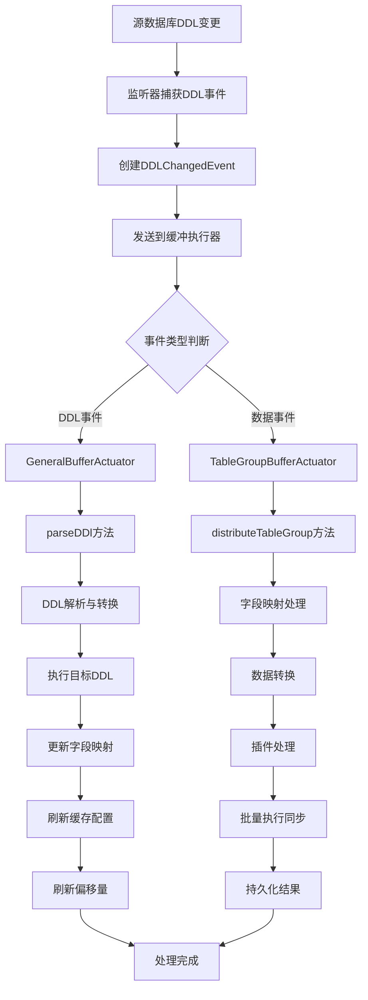
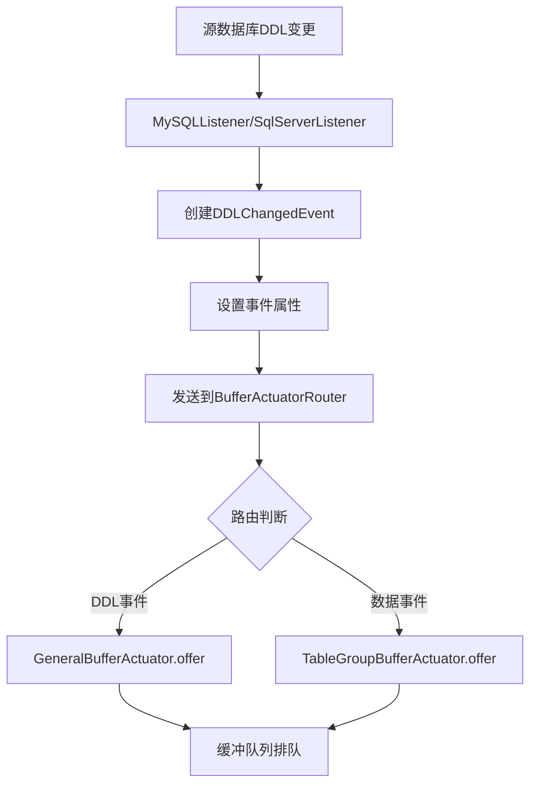
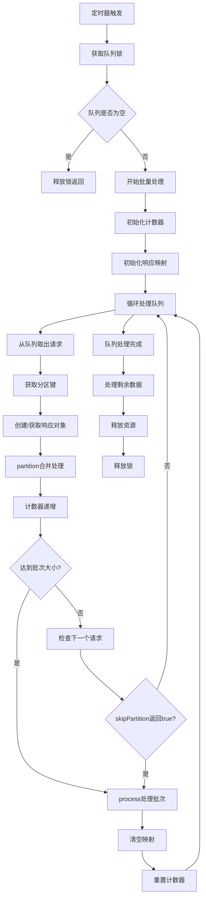
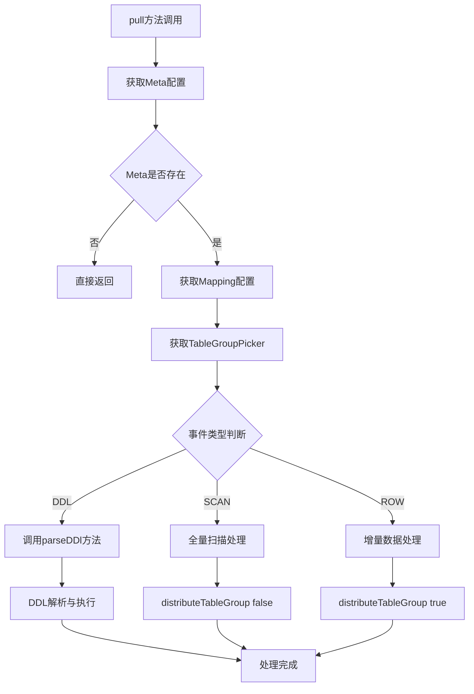
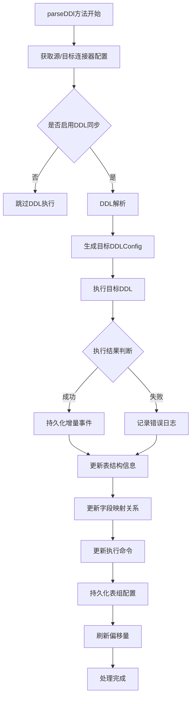
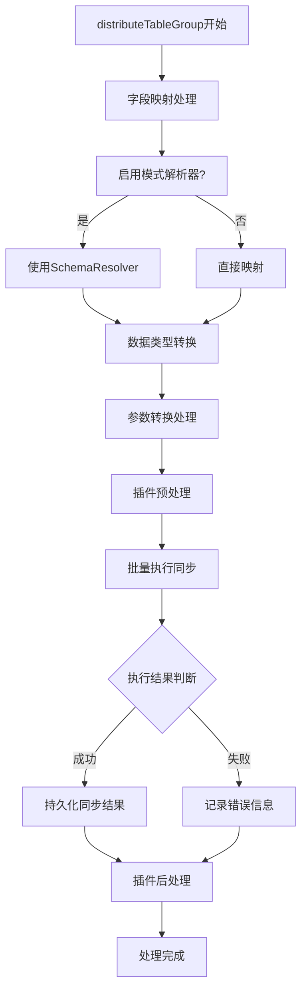
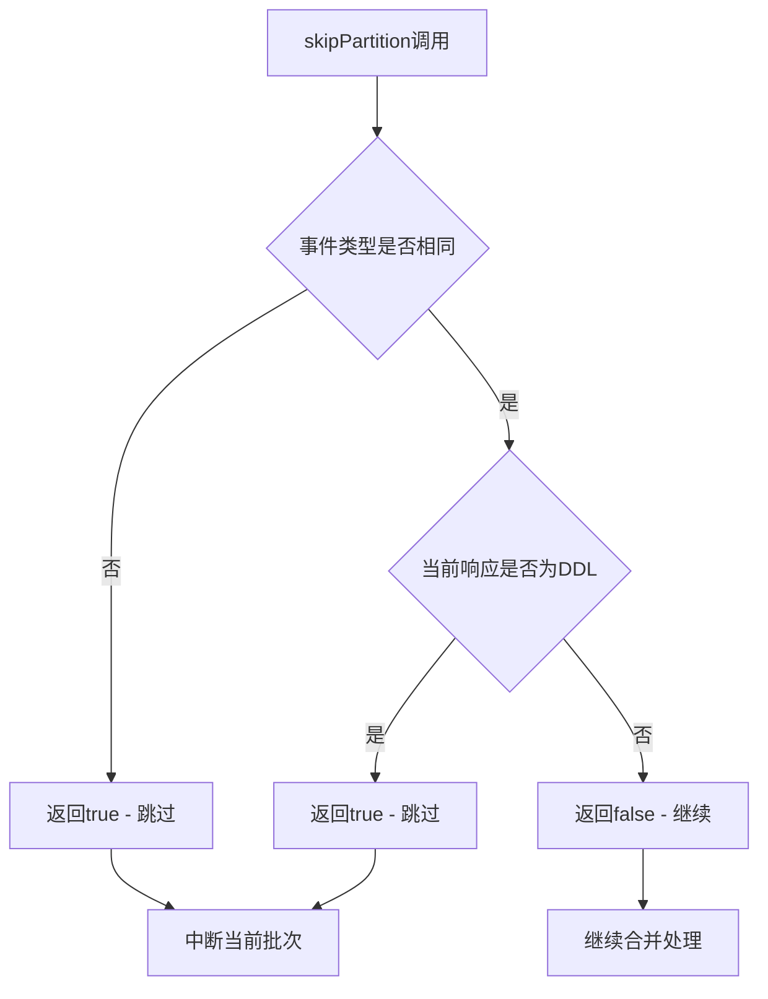
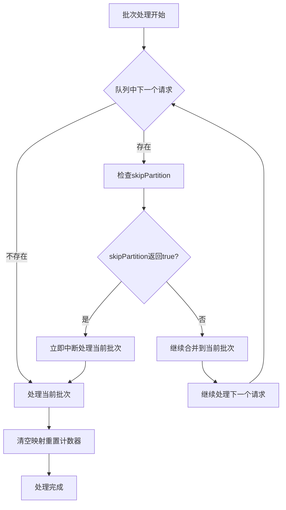
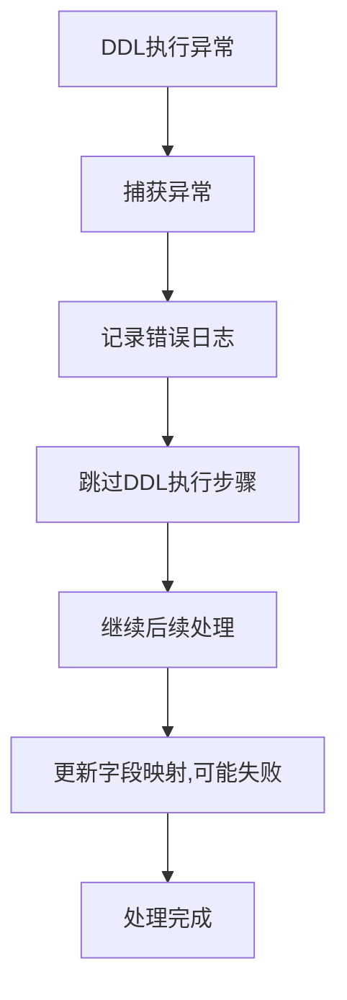
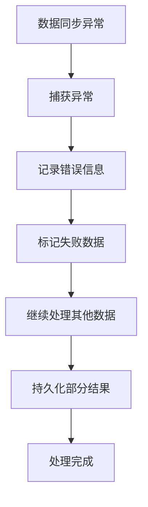

# DDL同步处理流程图

## 整体处理流程

## 详细处理步骤

### 1. 事件捕获阶段

### 2. 缓冲执行器处理阶段

#### 2.1 AbstractBufferActuator.submit() 方法

#### 2.2 GeneralBufferActuator.pull() 方法

### 3. DDL处理详细流程 (parseDDl方法)

### 4. 数据同步详细流程 (distributeTableGroup方法)

## 关键时序控制点

### 1. 分区跳过机制 (skipPartition)

### 2. 批次处理控制

## 异常处理流程

### 1. DDL执行异常

### 2. 数据同步异常

## 性能优化点

1. **批量处理**: 通过 `BufferPullCount` 控制批次大小
2. **分区合并**: 相同分区的请求合并处理
3. **异步执行**: 使用线程池异步执行数据同步
4. **缓存机制**: 表结构信息缓存减少数据库查询
5. **流式处理**: 支持大文件流式处理

这个流程图完整展示了从缓存拉取到执行目标库SQL的整个处理过程，包括DDL同步和数据同步的协调机制。