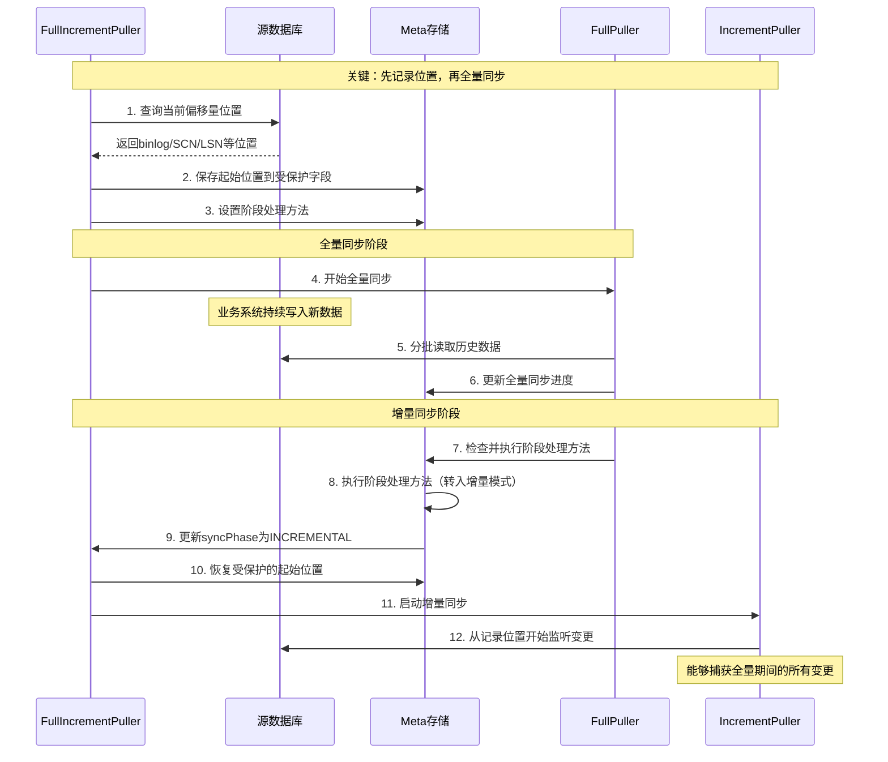

# DBSyncer 全量+增量混合模式分析

## 1. 概述

DBSyncer目前提供独立的"全量"和"增量"两种数据同步模式，为了满足更广泛的业务场景需求，需要实现全量+增量的混合同步模式。本文档详细分析实现该混合模式所需的技术改造工作。

## 2. 现状分析

### 2.1 当前同步模式架构

#### 全量同步模式（Full Synchronization）

- **实现类**：`FullPuller`
- **核心特性**：
  - 使用`Task`类跟踪同步进度
  - 通过`ParserEnum.PAGE_INDEX`、`ParserEnum.CURSOR`、`ParserEnum.TABLE_GROUP_INDEX`管理分页状态
  - 在`Meta.snapshot`中保存进度信息
  - 支持断点续传，从上次中断位置恢复
  - 适合初始数据迁移或大批量数据同步

#### 增量同步模式（Incremental Synchronization）

- **实现类**：`IncrementPuller`
- **核心特性**：
  - 使用`ChangedEvent`表示数据变更事件
  - 通过`Listener`监听数据源变更（binlog、CDC等）
  - 使用`BufferActuatorRouter`处理变更事件
  - 在`Meta.snapshot`中保存偏移量信息
  - 支持近实时数据同步

## 现有恢复机制分析与借鉴

### 2.3 现有独立模式的恢复机制

#### 2.3.1 FullPuller恢复特点

- **断点续传**：利用`Meta.snapshot`中的`pageIndex`、`cursor`、`tableGroupIndex`实现精确断点恢复
- **零配置恢复**：启动时自动从上次中断位置继续，无需额外配置
- **状态隔离**：Task状态独立管理，不干扰其他组件

#### 2.3.2 IncrementPuller恢复特点

- **Listener状态检查**：通过`meta.getListener() == null`判断是否需要重新创建
- **偏移量恢复**：Listener从`Meta.snapshot`中恢复数据库特定的偏移量信息
- **自动重连**：异常时自动清理并重新建立监听连接

#### 2.3.3 ManagerFactory统一恢复

- **系统启动恢复**：`PreloadTemplate`在系统启动时检查所有`MetaEnum.RUNNING`状态的任务并重新启动
- **状态清理**：Puller在关闭时根据任务状态自动重置Meta状态
- **异常回滚**：启动失败时自动回滚Meta状态

### 2.4 借鉴现有机制的设计原则

**与现有设计保持一致**：

1. **复用Meta.snapshot机制**：不重新发明轮子，继续使用现有的快照存储
2. **保持状态驱动模式**：利用现有的状态管理和检查机制
3. **延续零配置理念**：启动时自动检查恢复，无需额外配置
4. **维持状态简单性**：避免复杂的状态机，使用简单的状态判断

## 3. 全量+增量混合模式需求分析

### 3.1 业务场景

- **初始化+实时同步**：首次全量同步历史数据，后续增量同步新变更
- **定期全量+持续增量**：定时全量刷新基础数据，平时增量同步
- **故障恢复**：增量同步异常后，自动切换全量重新同步

### 3.2 技术需求

1. **模式定义**：需要新增`FULL_INCREMENT`混合同步模式
2. **任务协调**：实现全量和增量任务的启停协调
3. **状态同步**：统一管理全量和增量的执行状态
4. **数据一致性**：确保全量到增量切换时的数据一致性
5. **故障处理**：异常情况下的模式切换和恢复机制

## 4. 技术实现方案

### 4.1 枚举扩展

#### 4.1.1 ModelEnum 扩展

```java
public enum ModelEnum {
    FULL("full", "全量"),
    INCREMENT("increment", "增量"),
    FULL_INCREMENT("fullIncrement", "全量+增量");  // 新增混合模式

    // 新增判断方法
    public static boolean isFullIncrement(String model) {
        return StringUtil.equals(FULL_INCREMENT.getCode(), model);
    }

    public static boolean needFullSync(String model) {
        return isFull(model) || isFullIncrement(model);
    }

    public static boolean needIncrementSync(String model) {
        return StringUtil.equals(INCREMENT.getCode(), model) || isFullIncrement(model);
    }
}
```

#### 4.1.2 SyncPhaseEnum 扩展

```java
// 混合模式阶段枚举（将映射到 Meta 的 syncPhase 属性）
// 简化为两个主要阶段
public enum SyncPhaseEnum {
    FULL,        // 全量同步阶段 (包括 PENDING 和 RUNNING)
    INCREMENTAL  // 增量同步阶段 (持续运行)
}
```

### 4.2 混合模式Puller设计

#### 4.2.1 FullIncrementPuller 类结构

```java
@Component
public final class FullIncrementPuller extends AbstractPuller implements Puller {

    @Resource
    private FullPuller fullPuller;

    @Resource
    private IncrementPuller incrementPuller;

    @Resource
    private ProfileComponent profileComponent;

    @Resource
    private LogService logService;

    @Resource
    private ConnectorFactory connectorFactory;

    // FullIncrementPuller 将使用独立的 SyncPhaseEnum 枚举（定义在单独的文件中）
    // SyncPhaseEnum 简化为两个阶段：FULL, INCREMENTAL
}
```

#### 4.2.2 核心协调逻辑

**核心思想**：[FullPuller](file:///e:/github/dbsyncer/dbsyncer-manager/src/main/java/org/dbsyncer/manager/impl/FullPuller.java#L39-L173)只负责执行全量同步，不关心具体的回调逻辑。不同的任务可以在[Meta](file:///e:/github/dbsyncer/dbsyncer-parser/src/main/java/org/dbsyncer/parser/model/Meta.java#L15-L227)中设置不同的阶段处理方法，[FullPuller](file:///e:/github/dbsyncer/dbsyncer-manager/src/main/java/org/dbsyncer/manager/impl/FullPuller.java#L39-L173)在完成处理后检查并执行[Meta](file:///e:/github/dbsyncer/dbsyncer-parser/src/main/java/org/dbsyncer/parser/model/Meta.java#L15-L227)中的阶段处理方法。

核心实现代码：

```java
@Override
public void start(Mapping mapping) {
    final String metaId = mapping.getMetaId();

    Thread coordinator = new Thread(() -> {
        try {
            // 1. 检查故障恢复（零开销）
            // 修改为从 Meta 对象直接获取 syncPhase
            SyncPhaseEnum recoveryPhase = profileComponent.getMeta(mapping.getMetaId()).getSyncPhase();

            // 2. 根据阶段直接执行（内联逻辑，简化设计）
            switch (recoveryPhase) {
                case FULL:
                    // 记录增量起始点并执行全量同步
                    recordIncrementStartPoint(mapping);
                    startFullThenIncrement(mapping);
                    break;

                case INCREMENTAL:
                    // 直接启动增量（全量已完成）
                    startIncrementSync(mapping);
                    break;

                default:
                    throw new ManagerException("不支持的恢复阶段: " + recoveryPhase);
            }

        } catch (Exception e) {
            // 异常驱动：直接更新Meta状态为ERROR并记录错误信息
            Meta meta = profileComponent.getMeta(metaId);
            if (meta != null) {
                meta.saveState(MetaEnum.ERROR, e.getMessage());
                // 在logService中记录异常信息
                logService.log(LogType.TableGroupLog.FULL_INCREMENT_FAILED, "混合同步异常: {}，错误信息: {}", metaId, e.getMessage());
            }
            logger.error("混合同步异常，已更新Meta状态为ERROR: {}", metaId, e);
        }
    });

    coordinator.setName("full-increment-coordinator-" + mapping.getId());
    coordinator.start();
}

// 混合模式核心：先执行全量同步，完成后自动转入增量同步
private void startFullThenIncrement(Mapping mapping) {
    String metaId = mapping.getMetaId();

    // 直接使用原始Mapping，通过overridePuller机制控制行为
    Thread fullSyncThread = new Thread(() -> {
        try {
            // 1. 设置 Meta 的阶段处理方法
            Meta meta = profileComponent.getMeta(metaId);
            meta.setPhaseHandler(() -> {
                logger.info("全量同步完成，转入增量模式: {}", metaId);
                // 修改为更新 Meta 对象的 syncPhase 属性为 INCREMENTAL 阶段
                meta.updateSyncPhase(SyncPhaseEnum.INCREMENTAL);
                startIncrementSync(mapping);
            });

            // 2. 更新 Meta 对象的 syncPhase 属性为 FULL 阶段
            meta.updateSyncPhase(SyncPhaseEnum.FULL);

            // 3. 启动 FullPuller
            fullPuller.start(mapping);

        } catch (Exception e) {
            // 异常时更新Meta状态为ERROR并记录错误信息
            Meta meta = profileComponent.getMeta(metaId);
            if (meta != null) {
                meta.saveState(MetaEnum.ERROR, e.getMessage());
                // 在logService中记录异常信息
                logService.log(LogType.TableGroupLog.FULL_INCREMENT_FAILED, "全量同步异常: {}，错误信息: {}", metaId, e.getMessage());
            }
            logger.error("全量同步异常: {}", metaId, e);
        }
    });

    fullSyncThread.setName("mixed-full-sync-" + mapping.getId());
    fullSyncThread.start();
}

// 核心：运行全量同步并在完成后执行回调

private void recordIncrementStartPoint(Mapping mapping) {
    String metaId = mapping.getMetaId();
    Meta meta = profileComponent.getMeta(metaId);

    // 关键优化：检查是否已经记录，避免重复记录
    if (meta.isIncrementStartPointRecorded()) {
        logger.info("增量起始点已记录，跳过: {}", metaId);
        return;
    }

    // 简化设计：委托给连接器获取当前位置
    ConnectorConfig sourceConfig = getSourceConnectorConfig(mapping);
    ConnectorService connectorService = connectorFactory.getConnectorService(sourceConfig.getConnectorType());
    ConnectorInstance connectorInstance = connectorFactory.connect(sourceConfig);

    try {
        // 使用现有的getPosition方法，返回当前位置
        Object currentPosition = connectorService.getPosition(connectorInstance);

        // 使用Meta类中的方法记录增量起始点到受保护字段
        meta.recordIncrementStartPoint(sourceConfig.getConnectorType(), currentPosition, 0);

    } catch (Exception e) {
        // 异常时使用数据库服务器时间戳备用
        try {
            long dbServerTime = getDatabaseServerTime(connectorService, connectorInstance);
            // 使用Meta类中的方法记录增量起始点到受保护字段
            meta.recordIncrementStartPoint(sourceConfig.getConnectorType(), null, dbServerTime);
        } catch (Exception ex) {
            // 如果获取数据库时间也失败，则使用应用服务器时间
            logger.warn("无法获取数据库服务器时间，回退到应用服务器时间: {}", ex.getMessage());
            // 使用Meta类中的方法记录增量起始点到受保护字段
            meta.recordIncrementStartPoint(sourceConfig.getConnectorType(), null, System.currentTimeMillis());
        }
    } finally {
        // 清理连接资源
        connectorService.disconnect(connectorInstance);
    }

    logger.info("已记录增量同步起始位置: metaId={}", metaId);
}

/**
 * 获取数据库服务器的当前时间戳
 * @param connectorService 连接器服务
 * @param connectorInstance 连接器实例
 * @return 数据库服务器时间戳（毫秒）
 */
private long getDatabaseServerTime(ConnectorService connectorService, ConnectorInstance connectorInstance) {
    try {
        // 假设ConnectorService提供getDbServerTime方法来获取数据库时间
        // 这需要在ConnectorService接口中定义并在各具体实现类中实现
        return connectorService.getDbServerTime(connectorInstance);
    } catch (UnsupportedOperationException e) {
        // 如果连接器不支持获取数据库时间，则抛出异常让调用者处理
        throw e;
    } catch (Exception e) {
        logger.warn("获取数据库服务器时间时发生异常: {}", e.getMessage());
        throw new ManagerException("无法获取数据库服务器时间", e);
    }
}

private void startIncrementSync(Mapping mapping) {
    String metaId = mapping.getMetaId();
    Meta meta = profileComponent.getMeta(metaId);

    // 关键：恢复受保护的增量起始点到正常字段
    meta.restoreProtectedIncrementStartPoint();

    // 直接使用原始Mapping启动增量同步
    incrementPuller.start(mapping);

    logger.info("增量同步已启动，混合模式进入持续运行状态: {}", metaId);
}
```

### 4.3 状态管理增强

#### 4.3.1 Meta 扩展设计

为支持混合模式的阶段管理，已在 [Meta](file:///e:/github/dbsyncer/dbsyncer-parser/src/main/java/org/dbsyncer/parser/model/Meta.java#L15-L227) 类中新增一个 `syncPhase` 枚举属性，专门用于记录混合同步任务的当前执行阶段。同时，保留 `snapshot` 用于存储其他进度和上下文信息。并增加 `getSyncPhase` 和 `updateSyncPhase` 方法。

为了实现回调隔离，还在 [Meta](file:///e:/github/dbsyncer/dbsyncer-parser/src/main/java/org/dbsyncer/parser/model/Meta.java#L15-L227) 类中添加了回调函数支持：

```java
// Meta 类中新增的属性和方法 (示意)
private SyncPhaseEnum syncPhase; // 混合同步阶段，例如：FULL, INCREMENTAL

// 在Meta.snapshot中保留的其他字段，用于存储非结构化或上下文信息
public static final String FULL_START_TIME = "fullStartTime";
public static final String FULL_END_TIME = "fullEndTime";
public static final String INCREMENT_START_TIME = "incrementStartTime";
public static final String LAST_SYNC_CHECKPOINT = "lastSyncCheckpoint";

// 简化的受保护字段名常量
private static final String PROTECTED_INCREMENT_RECORDED = "_protected_increment_recorded";
private static final String PROTECTED_CURRENT_POSITION = "_protected_current_position";
private static final String PROTECTED_CONNECTOR_TYPE = "_protected_connector_type";
private static final String PROTECTED_INCREMENT_START_TIME = "_protected_increment_start_time";

// 回调函数支持
@JSONField(serialize = false)
private transient Runnable phaseHandler;

// 新增的实例方法
public SyncPhaseEnum getSyncPhase() {
    return syncPhase;
}

public void setSyncPhase(SyncPhaseEnum syncPhase) {
    this.syncPhase = syncPhase;
}

public void updateSyncPhase(SyncPhaseEnum phase) {
    this.syncPhase = phase;
    // 假设 Meta 类提供了 save 或类似方法来持久化自身
    this.profileComponent.editConfigModel(this);
    logger.info("更新混合同步阶段: metaId={}, phase={}", this.getMetaId(), phase);
}

// 回调函数支持
public void setPhaseHandler(Runnable handler) {
    this.phaseHandler = handler;
}

public Runnable getPhaseHandler() {
    return this.phaseHandler;
}

public void executePhaseHandler() {
    if (this.phaseHandler != null) {
        try {
            this.phaseHandler.run();
        } finally {
            // 执行后清理，避免重复执行
            this.phaseHandler = null;
        }
    }
}

// 检查是否已记录增量起始点
public boolean isIncrementStartPointRecorded() {
    return "true".equals(this.snapshot.get(PROTECTED_INCREMENT_RECORDED));
}

// 记录增量起始点到受保护字段
public void recordIncrementStartPoint(String connectorType, Object currentPosition, long dbServerTime) {
    if (currentPosition != null) {
        // 保存到受保护的字段
        this.snapshot.put(PROTECTED_CURRENT_POSITION, String.valueOf(currentPosition));
        this.snapshot.put(PROTECTED_CONNECTOR_TYPE, connectorType);
        logger.info("已记录增量起始位置: metaId={}, connectorType={}, position={}", 
                   this.getMetaId(), connectorType, currentPosition);
    } else {
        // 如果连接器不支持位置获取，使用数据库服务器时间戳
        this.snapshot.put(PROTECTED_INCREMENT_START_TIME, String.valueOf(dbServerTime));
        logger.info("连接器不支持位置获取，使用数据库服务器时间戳: {}", this.getMetaId());
    }

    this.snapshot.put(PROTECTED_INCREMENT_RECORDED, "true"); // 标记已记录

    // 保存到持久化存储
    this.profileComponent.editConfigModel(this);
    logger.info("已记录增量同步起始位置到受保护字段: metaId={}", this.getMetaId());
}

// 恢复受保护的增量起始点到正常字段
public void restoreProtectedIncrementStartPoint() {
    // 检查是否有受保护的字段
    if (!isIncrementStartPointRecorded()) {
        logger.warn("未找到受保护的增量起始点，增量同步可能从当前时间开始: {}", this.getMetaId());
        return;
    }

    // 简化设计：直接恢复位置信息，让各连接器自己解析
    String currentPosition = this.snapshot.get(PROTECTED_CURRENT_POSITION);
    String connectorType = this.snapshot.get(PROTECTED_CONNECTOR_TYPE);
    String incrementStartTime = this.snapshot.get(PROTECTED_INCREMENT_START_TIME);

    if (StringUtil.isNotBlank(currentPosition)) {
        // 恢复位置信息到标准字段（供IncrementPuller使用）
        this.snapshot.put("position", currentPosition);
        logger.info("恢复增量位置: connectorType={}, position={}", connectorType, currentPosition);
    } else if (StringUtil.isNotBlank(incrementStartTime)) {
        // 使用时间戳备用
        this.snapshot.put("incrementStartTime", incrementStartTime);
        logger.info("恢复增量时间戳: {}", incrementStartTime);
    } else {
        logger.warn("无可用的增量起始信息: {}", this.getMetaId());
    }

    // 删除受保护的变量
    this.snapshot.remove(PROTECTED_CURRENT_POSITION);
    this.snapshot.remove(PROTECTED_CONNECTOR_TYPE);
    this.snapshot.remove(PROTECTED_INCREMENT_START_TIME);
    this.snapshot.remove(PROTECTED_INCREMENT_RECORDED);

    // 保存到持久化存储
    this.profileComponent.editConfigModel(this);
    logger.info("已恢复增量起始点: {}", this.getMetaId());
}
```

### 4.4 FullPuller 改造

为了支持混合模式的阶段处理方法机制，需要对 [FullPuller](file:///e:/github/dbsyncer/dbsyncer-manager/src/main/java/org/dbsyncer/manager/impl/FullPuller.java#L39-L173) 进行改造。改造的核心思想是让 [FullPuller](file:///e:/github/dbsyncer/dbsyncer-manager/src/main/java/org/dbsyncer/manager/impl/FullPuller.java#L39-L173) 在完成全量同步后检查 [Meta](file:///e:/github/dbsyncer/dbsyncer-parser/src/main/java/org/dbsyncer/parser/model/Meta.java#L15-L227) 对象中是否设置了阶段处理方法，如果有则执行，否则直接关闭。

改造要点：

1. 在 `doTask` 方法执行完成后，检查 [Meta](file:///e:/github/dbsyncer/dbsyncer-parser/src/main/java/org/dbsyncer/parser/model/Meta.java#L15-L227) 对象中是否设置了阶段处理方法
2. 如果设置了阶段处理方法，则执行该方法
3. 如果没有设置阶段处理方法，则按照原有逻辑直接关闭

```java
// FullPuller 改造示例
private void doTask(Task task, Mapping mapping, List<TableGroup> list, Executor executor) {
    // 记录开始时间
    long now = Instant.now().toEpochMilli();
    task.setBeginTime(now);
    task.setEndTime(now);

    // 获取上次同步点
    Meta meta = profileComponent.getMeta(task.getId());
    Map<String, String> snapshot = meta.getSnapshot();
    task.setPageIndex(NumberUtil.toInt(snapshot.get(ParserEnum.PAGE_INDEX.getCode()),
            ParserEnum.PAGE_INDEX.getDefaultValue()));
    // 反序列化游标值类型(通常为数字或字符串类型)
    task.setCursors(PrimaryKeyUtil.getLastCursors(snapshot.get(ParserEnum.CURSOR.getCode())));
    task.setTableGroupIndex(NumberUtil.toInt(snapshot.get(ParserEnum.TABLE_GROUP_INDEX.getCode()),
            ParserEnum.TABLE_GROUP_INDEX.getDefaultValue()));
    flush(task);

    try {
        int i = task.getTableGroupIndex();
        while (i < list.size()) {
            parserComponent.execute(task, mapping, list.get(i), executor);
            if (!task.isRunning()) {
                break;
            }
            task.setPageIndex(ParserEnum.PAGE_INDEX.getDefaultValue());
            task.setCursors(null);
            task.setTableGroupIndex(++i);
            flush(task);
        }
    } finally {
        // 记录结束时间
        task.setEndTime(Instant.now().toEpochMilli());
        task.setTableGroupIndex(ParserEnum.TABLE_GROUP_INDEX.getDefaultValue());
        flush(task);

        // 检查并执行 Meta 中的阶段处理方法
        meta = profileComponent.getMeta(task.getId());
        if (meta != null) {
            meta.executePhaseHandler();
        }
    }
}
```

这种改造方式的优势：

1. **保持兼容性**：独立使用的 [FullPuller](file:///e:/github/dbsyncer/dbsyncer-manager/src/main/java/org/dbsyncer/manager/impl/FullPuller.java#L39-L173) 不受影响，因为它们的 [Meta](file:///e:/github/dbsyncer/dbsyncer-parser/src/main/java/org/dbsyncer/parser/model/Meta.java#L15-L227) 对象中不会设置阶段处理方法
2. **职责清晰**：[FullPuller](file:///e:/github/dbsyncer/dbsyncer-manager/src/main/java/org/dbsyncer/manager/impl/FullPuller.java#L39-L173) 只负责执行全量同步，具体的后续处理由 [Meta](file:///e:/github/dbsyncer/dbsyncer-parser/src/main/java/org/dbsyncer/parser/model/Meta.java#L15-L227) 中的阶段处理方法决定
3. **易于维护**：改造简单，只需要在适当位置添加检查和执行阶段处理方法的代码

### 4.5 ManagerFactory 改造

#### 4.5.1 Puller 获取逻辑扩展

需要修改 ManagerFactory 中的 getPuller 方法，添加对 FULL_INCREMENT 模式的支持：

```java
private Puller getPuller(Mapping mapping) {
    Assert.notNull(mapping, "驱动不能为空");
    String model = mapping.getModel();

    // 混合模式使用专用的 FullIncrementPuller
    if (ModelEnum.isFullIncrement(model)) {
        return map.get("fullIncrementPuller");
    }

    // 原有逻辑保持不变
    String pullerName = model.concat("Puller");
    Puller puller = map.get(pullerName);
    Assert.notNull(puller, String.format("未知的同步方式: %s", model));
    return puller;
}
```

### 4.6 数据一致性保证

时序图：确保数据一致性的关键步骤



**重要说明**：

1. **回调机制的隔离性**：由于[FullPuller](file:///e:/github/dbsyncer/dbsyncer-manager/src/main/java/org/dbsyncer/manager/impl/FullPuller.java#L39-L173)是单例对象，我们必须实现基于[metaId](file:///e:/github/dbsyncer/dbsyncer-parser/src/main/java/org/dbsyncer/parser/model/Meta.java#L23-L23)的回调机制，确保独立使用的[FullPuller](file:///e:/github/dbsyncer/dbsyncer-manager/src/main/java/org/dbsyncer/manager/impl/FullPuller.java#L39-L173)不会触发混合模式的回调函数。
2. **资源管理**：通过基于[metaId](file:///e:/github/dbsyncer/dbsyncer-parser/src/main/java/org/dbsyncer/parser/model/Meta.java#L23-L23)的回调机制确保在全量同步完成后正确转入增量同步，避免资源无法释放的问题。

## 5. UI界面改造

### 5.1 同步模式选择扩展

- 在驱动配置页面的同步模式下拉框中新增"全量+增量"选项
- 新增混合模式的配置参数界面

### 5.2 监控界面增强

```html
<!-- 混合模式状态显示 -->
<div th:if="${mapping.model eq 'fullIncrement'}">
    <div class="sync-phase-indicator">
        <span class="phase-label" th:classappend="${meta.syncPhase.name() eq 'FULL'} ? 'active' : ''">
            全量同步阶段
        </span>
        <span class="phase-separator">→</span>
        <span class="phase-label" th:classappend="${meta.syncPhase.name() eq 'INCREMENTAL'} ? 'active' : ''">
            增量同步阶段
        </span>
    </div>

    <!-- 详细进度信息 -->
    <div class="phase-details">
        <div th:if="${meta.syncPhase.name() eq 'FULL'}">
            全量进度: <span th:text="${meta.fullProgress}">0%</span>
            预计剩余时间: <span th:text="${meta.estimatedTime}">--</span>
        </div>
        <div th:if="${meta.syncPhase.name() eq 'INCREMENTAL'}">
            增量状态: 实时同步中
            处理速度: <span th:text="${meta.incrementTps}">0</span> TPS
        </div>
    </div>
</div>
```

## 6. 总结

全量+增量混合模式的设计充分考虑了现有架构的特点，通过扩展枚举、增强状态管理、改造现有组件等方式实现了一个功能完整、逻辑清晰的解决方案。该方案具有以下特点：

1. **兼容性好**：在不破坏现有功能的前提下，扩展了新的同步模式
2. **职责清晰**：各组件职责明确，FullPuller只负责全量同步，FullIncrementPuller负责协调
3. **回调隔离**：通过在Meta中设置阶段处理方法，避免了单例FullPuller的回调干扰问题
4. **数据一致性**：通过先记录增量起始位置再执行全量同步的方式，确保数据一致性
5. **故障恢复**：利用Meta中的syncPhase状态实现故障恢复
6. **易于维护**：改造集中在几个关键点，不影响现有代码结构

该设计方案已经形成了完整的闭环，从枚举扩展、状态管理、组件改造到UI界面，覆盖了全量+增量混合模式的所有方面。
